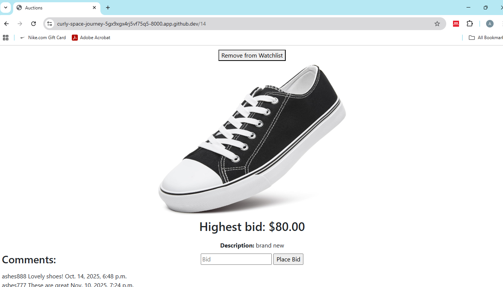
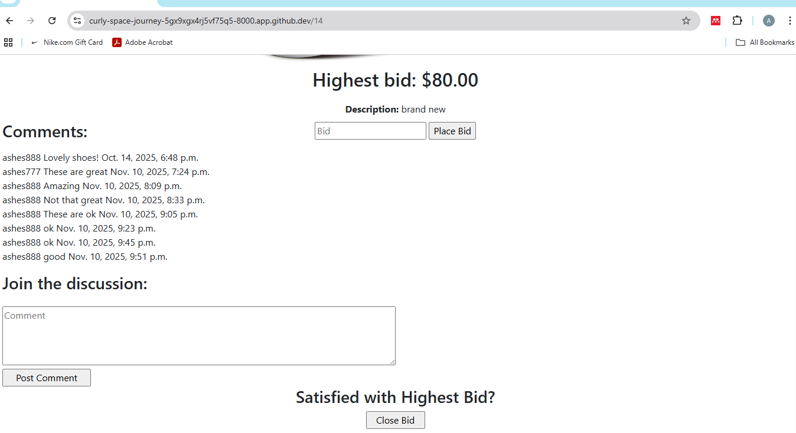

# Commerce
Commerce is an online platform where users can post objects for auction and receive bids on those items.

Video demo: https://youtu.be/wUlztl5O8XQ

## Specification
Tech used: HTML, CSS, Python, JavaScript, Django

Outside of scanning active listings, users are required to login to access all features on the platform. After signing in, users can create their own listing and view all details on active listings. They can further make a bid on an item, add the item to their watchlist, and post comments. 

If a user is viewing their own listing, they can also close the bidding process. This assigns the user with the highest bid as the winner and notifies them. 

## How to run application

Use: python manage.py runserver
