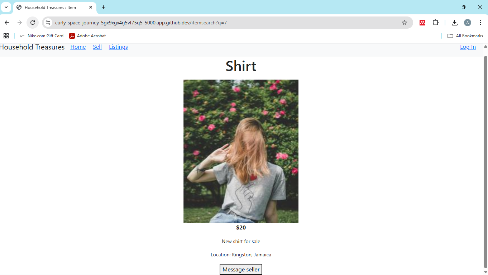
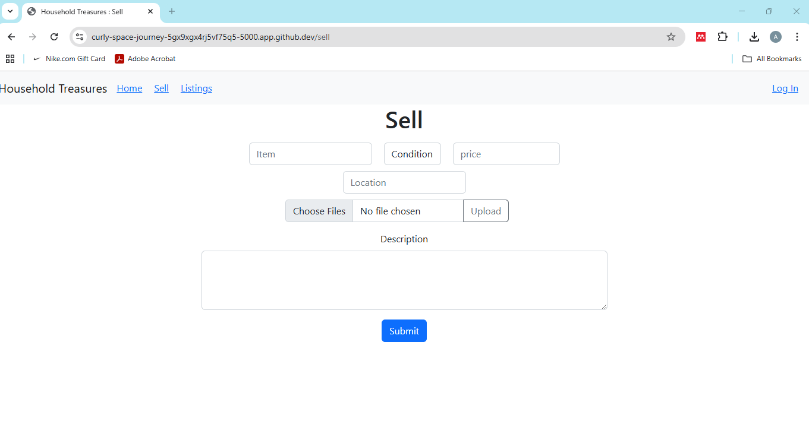
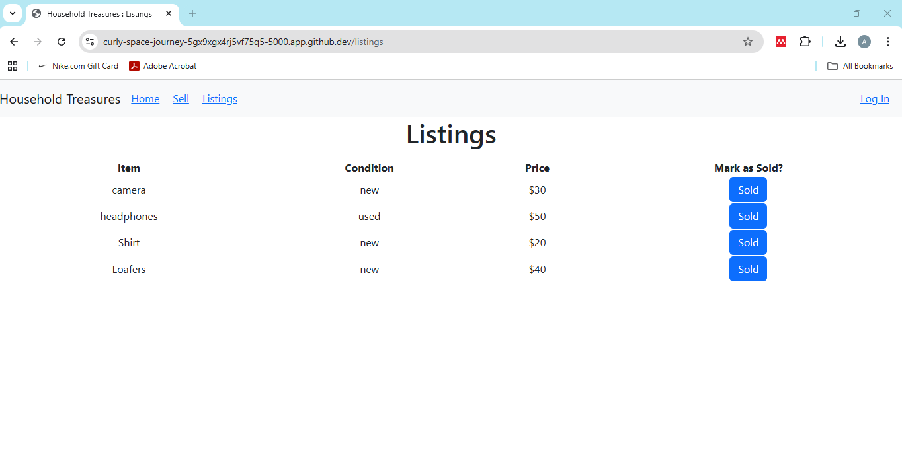

# Household Treasures
#### Video Demo:  <https://youtu.be/50IirflhgTE>

## Description:

#### Tech used: HTML, CSSS, Javascript, Flask

Household Treasures is a web application that allows users to post, sell and buy items. Upon accessing the site, users are redirected to the login.html page, where they are required to login using their username and password. The login required function in the helpers.py file prevents users from accessing other components of the website without first logging in. If users submit a wrong password combination, the login route issues an error.

If users do not have an account, there is a hyperlink, which links to the register.html page. Here, the users will have to provide a username, email, password and confirmation of the password. There is also a checkbox, which toggles the visibility of the password and confirmation fields. Checks are incorporated into the register route to ensure that none of these fields are missing. Missing input in any of these fields prompts the error function, rendering the error.html template which specifies the relevant mistake. After registering, information is submitted to the register route and stored in the htreasures database.Users are given a unique primary key that is autoincremented, and their username, email and a hash of their password is stored.

After logging in, users can access the other routes in the application. They are redirected to the homepage, index.html, which shows all the items posted by users on the platform. The name of the item, its picture, description and cost are shown as cards, which uses Boostrap as outlined in cards.html. Users can also search the posts for a specific item using the search bar. The page automatically shows the matching item during every keystroke. After clicking on the price, users are redirected to a specific item page, item.html. This is generated by having the item’s unique id listed as an unseen data-item that is sent as a query in the url. Afterwards, the page pulls the relevant information from the database and illustrates it on the page. This page has the item’s name, a carousel showing all the pictures posted, its price and description. For multiple images, there are previous and next buttons controlling the shifting of the images. There is further a "message seller" button, which automatically sends an email to the seller asking for the availability of the item. The Buyer's email address is also listed as the sender, allowing both the buyer and seller to communicate and arrange a meeting.

The web application further allows sellers to post items, when clicking the sell hyperlink. Users are redirected to sell.html, where they fill out a form detailing the item, its condition, price, user's location, pictures and description. Pressing on 'choose files', opens a dialog box where users can select multiple pictures to upload, while clicking on upload shows the actual names of the files uploaded. Submitting this form, posts the information on the home page, index.html, and stores the information in a database htreasures.db. Items are given a unique primary key and the seller's id as well as all relevant information are stored in the database. Images submitted are resized to 256 by 256 and stored in a project directory. The file paths are stored in the database. Multiple file paths are merged in a string with the separator as a comma.

Furthermore, users can see a table of their listings by clicking the link on the navigation bar. They are redirected to lisitings.html, which shows every item listed in a table with their respective condition and price. There is also a button for each item marked 'sold', which sends the item id to the listing route, which then deletes the item from the database and from the homepage.

There are several files responsible for the design and workings of the web application. The layout html provides the blueprint for the website, entailing a navigation bar, modifiable titles, headings and code sections. There are also links referring to the CSS and Bootstrap style sheets and code, which allows the website to be properly sized on mobile devices. The styles.css file has code pertaining to designing the overall layout, aligning the content in the cards and its container as well as organizing the various input fields listed on the sell page.The app.py file contains all the code for each route. It further specifies the packages to import and how to configure flask as well as the email system. Helpers.py depict the code for the login-required function, while the requirements.txt file lists the required programming packages.

## How to run application

Use: flask run
