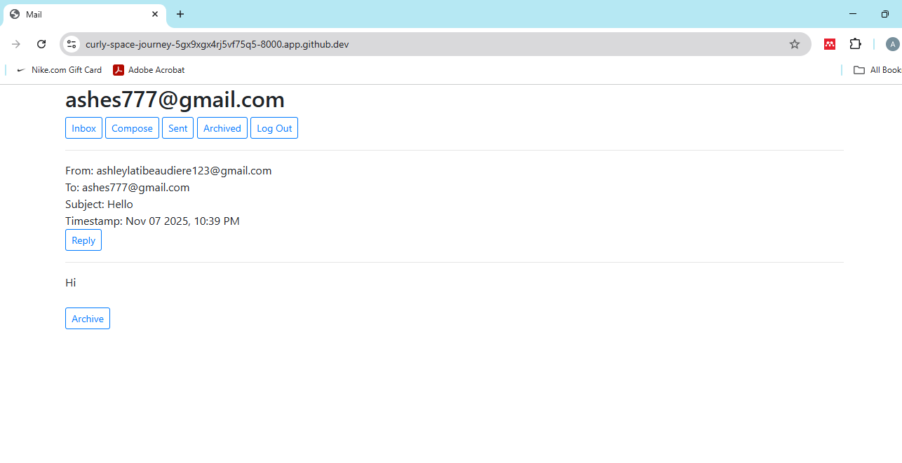
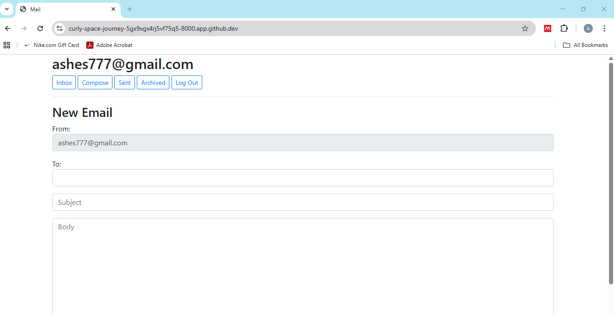

# Mail
Mail is a single page web application where users can send, receive and archive e-mail.

Video demo: https://youtu.be/I2wBZTazk3Q

## Specification
Tech used: HTML, CSS, Python, JavaScript and Django

After signing in, users are redirected to their inbox, where ‘read’ emails appear white and unopened emails appear gray. Clicking on a specific email opens its contents while also allowing users to reply and/or archive an email. 

Users can also construct their own emails to be sent to another registered user on the platform. Sent and archived emails are accessible in their respective tabs. 

## Role
I developed the front-end aspect of the website and used JavaScript to send API calls to the web server.

## How to run application

Use: python manage.py runserver
